# インターネット上に公開してみよう

## はじめに
本講座では，メイン講座で作成したWebページをインターネット上に公開する方法を説明します．

> [!IMPORTANT]
> GitHubのアカウントが必要ですので，アカウントをお持ちでない方は，[こちらのページ](https://docs.github.com/ja/get-started/quickstart/creating-an-account-on-github)に沿ってアカウント作成を済ませてから取り組んでみてください．不明点がありましたらお近くのCore-teamメンバーまでお声がけください．

## リポジトリを作成する
まずは公開したいファイルを置く場所である **リポジトリ** を作成します．  

1. まずは[GitHub](https://github.com)にアクセスします．このような画面が開きます．
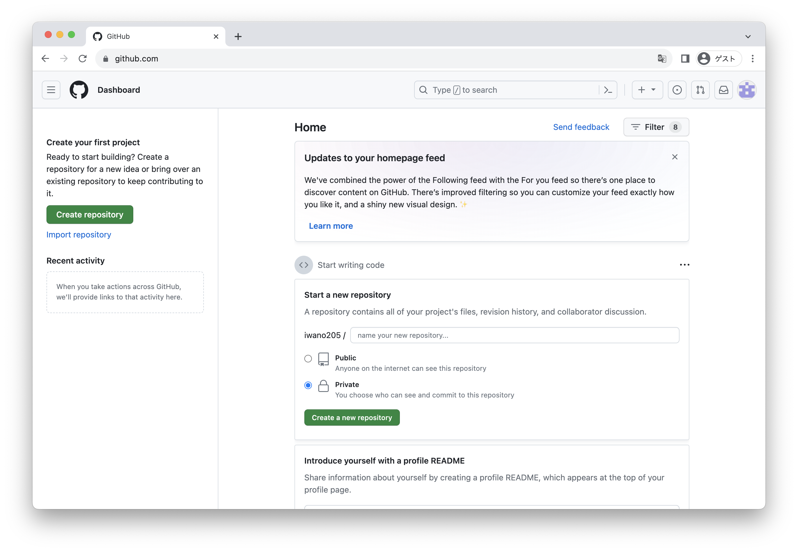  

2. ページの右上隅で`+`を選択し，**[New Repository]** をクリックします．  
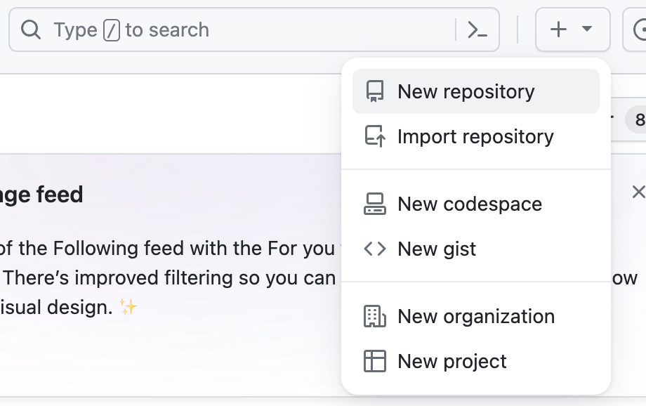

1. `Repository name`のところに`<自分のusername>.github.io`と入力します．
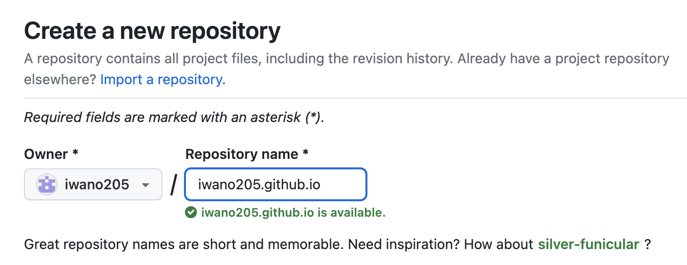
> [!NOTE]
> usernameが`iwano205`の場合，レポジトリの名前を`iwano205.github.io`にします．自分のusernameの末尾に`.github.io`を連接します．  

1. 入力が完了したら，最下部の **[Create repository]** をクリックします．
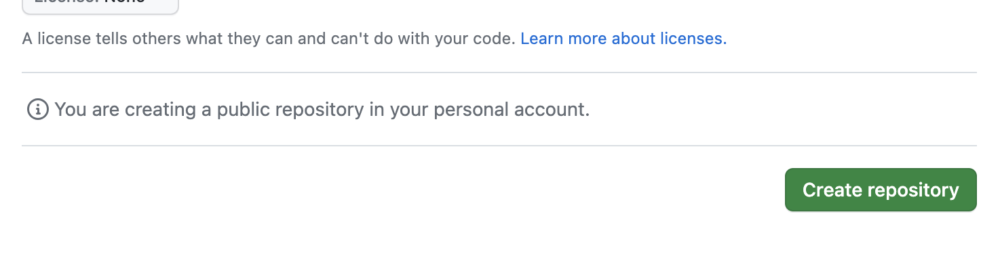

1. この画面が表示されたら完了です．

## ファイルをアップロードする
これでリポジトリの準備ができましたので，実際に公開したいファイルをアップロードしましょう．
1. 先ほど作成したリポジトリのページの中の **[upload an existing file]** をクリックします．
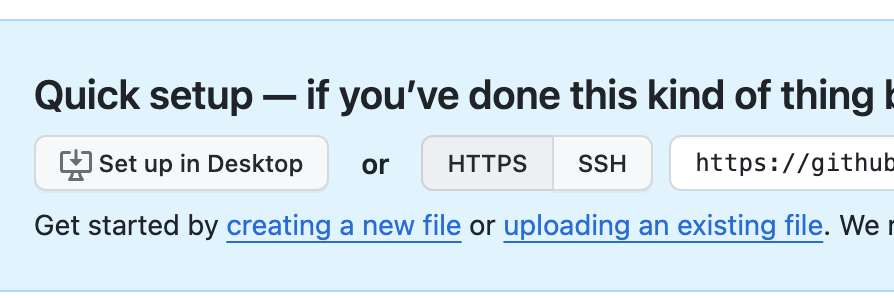
> [!NOTE]
> リポジトリのページを開いているとき，ブラウザのアドレスバーには`https://github.com/<自分のusername>/<自分のusername>.github.io`と表示されていると思いますので，末尾に`/upload`と入力してEnterを押すことでもアクセスできます．

2. このような画面が開きます．
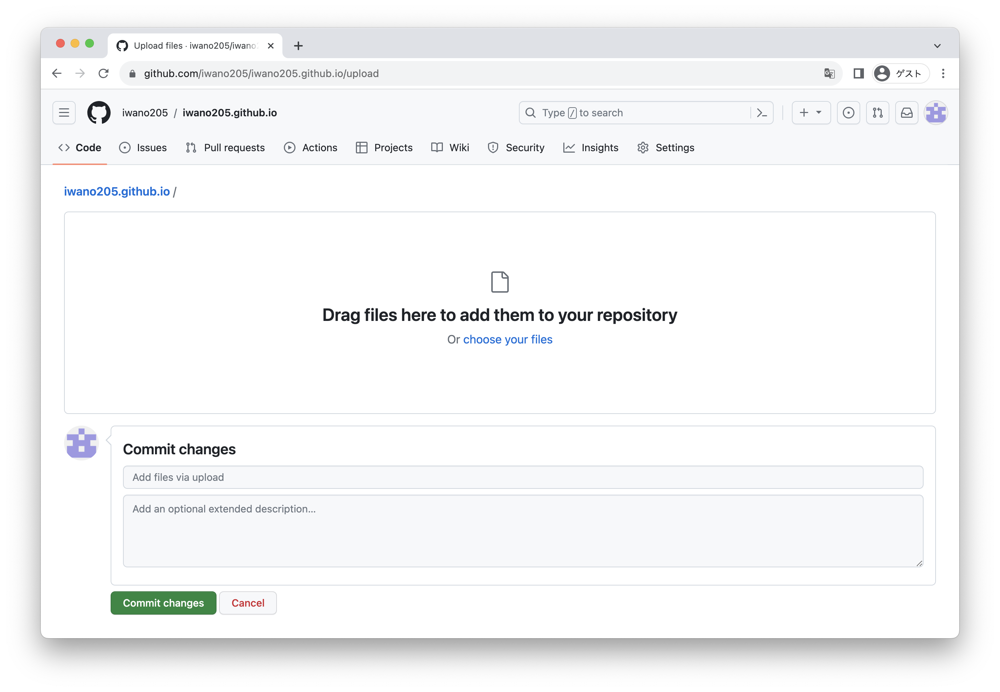  

3. エクスプローラーで`webdev`フォルダを開きます．先ほど作成した`first.html`を`index.html`というファイル名に変更します．

4. ドラッグ&ドロップして`index.html`をアップロードします．
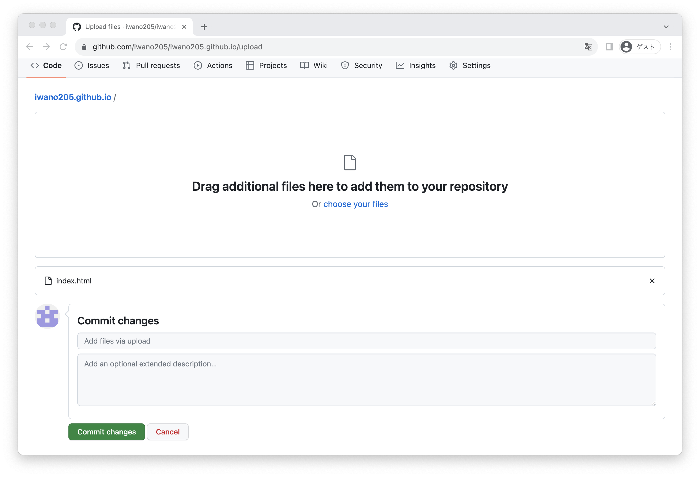
> [!WARNING]
> - 個人情報が含まれているファイルはアップロードしないでください．誤ってアップロードした場合は，これ以降の作業を行う前にお近くのCore-teamメンバーまでお声がけください．
> - アップロードする画像の著作権，肖像権にもご注意ください．
5. **[Commit changes]** をクリックします．
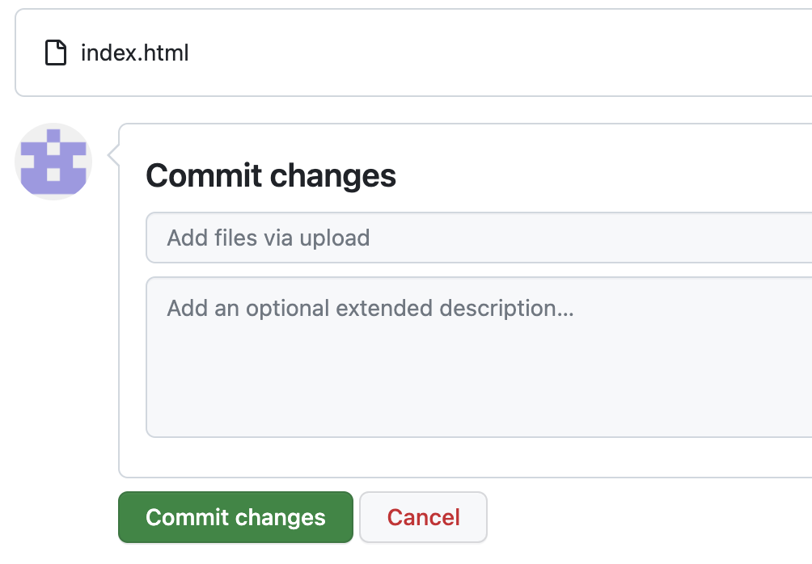

6. この画面が表示されたら完了です．
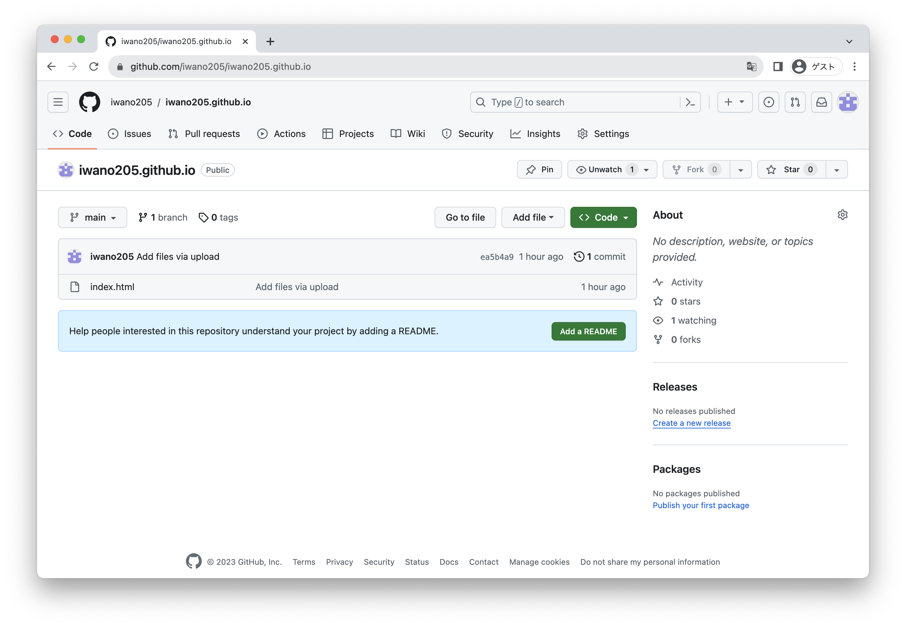

## ページの公開
ここまでの作業でページの公開の下準備が終わりました．最後に公開しましょう．
1. リポジトリのページを開き，右上の **[Settings]** をクリックします．
  

2. 左カラムの **[Pages]** をクリックします．
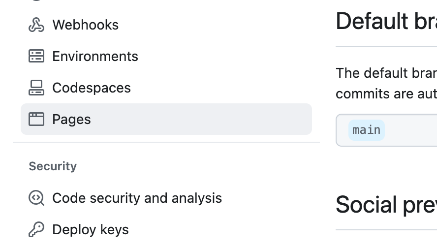

3. `Your site live at ~`というようなことが書かれていたら既に公開されています．**[Visit site]** を押してアクセスしてみましょう．
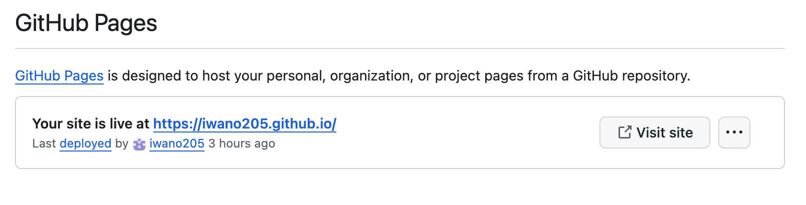  

4. このように自分で書いたHTMLのページが表示されます．
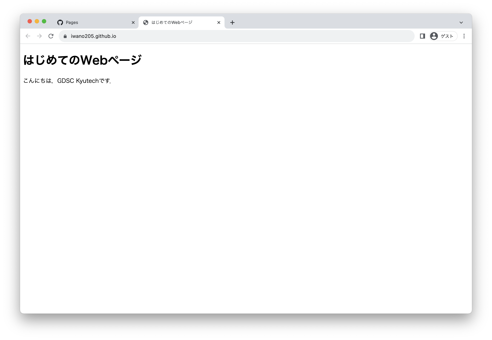

## まとめ
自分で作成したWebページをインターネット上に公開することができたかと思います！今回は[GitHub Pages](https://docs.github.com/ja/pages/getting-started-with-github-pages/about-github-pages)というサービスを利用して簡単に公開できました．`webdev`フォルダの中身のように，ページを増やしたり画像を追加することも可能ですのでぜひ試してみてください．

[目次に戻る](../README.md)
